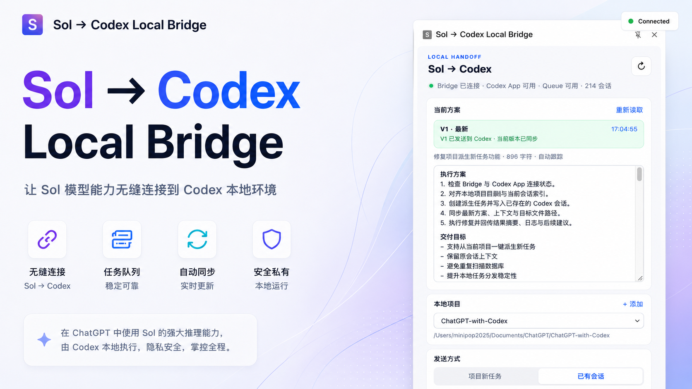

# Sol ↔ Codex Local Bridge



<p align="center">
  <strong>Exchange context between ChatGPT and Codex locally.</strong>
</p>

<p align="center">
  Think in ChatGPT. Build in Codex.
</p>

<p align="center">
  <a href="README.md">中文</a> · <a href="README.en.md">English</a>
</p>

---

## What is Sol ↔ Codex?

**Sol ↔ Codex Local Bridge** is a macOS-only Chrome extension and local Bridge with two-way handoff: send plans from Sol to Codex, or bring Codex context back to Sol.

It connects the last step between ChatGPT and Codex:

```text
ChatGPT
    ↕
Chrome Extension
    ↕
127.0.0.1 Local Bridge
    ↕
Codex Session / Project Files / Git
```

Plan and discuss in ChatGPT, then send the current response directly to Codex on your Mac.

No more repeating:

**Copy → switch to Codex → find a project → find a session → paste.**

## ✨ Core features

### 🌐 Chinese / English UI

Switch the side panel and inline ChatGPT actions between Chinese and English. The selected language is remembered.

### 🔗 ChatGPT → Codex one-click handoff

Send either:

- the latest ChatGPT assistant response;
- text selected on the page.

The content is handed off to the configured local Codex project or session.

### Codex → Sol context pull

The latest assistant response includes:

```text
← Sol        Codex →
```

Click `← Sol` to read context from the selected project and session:

- recent progress snapshot;
- session transcript;
- Git diff;
- read-only project files and text previews.

Reading is always an explicit user action. The extension only offers **Insert into ChatGPT** and never sends the ChatGPT message automatically.

### 📁 Local projects

The Bridge reads available projects from local Codex state.

After selecting a target project, you can create a new Codex task.

> A new project task can use a regular folder; it does not have to be a Git repository.

### 💬 Continue an existing session

Select an existing Codex session and append new analysis, changes, or requirements while keeping its context.

### ⚡ Inline send and pull

The latest ChatGPT response includes:

`← Sol    Codex →`

These buttons work even when the side panel is closed and use the saved project, send mode, and target session.

### ⏱️ Execution status

After creating a new task, the extension shows execution animation, elapsed time, and the current status. If enabled, Codex opens automatically after the handoff completes.

## Two send modes

### 01 · New project task

Send the current ChatGPT content as a new Codex task.

Useful for:

- new features;
- bug fixes;
- UI changes;
- refactors;
- independent development tasks.

### 02 · Existing session

Append the current content to an existing Codex session.

Useful for:

- continuing unfinished work;
- revising an earlier implementation;
- adding requirements;
- iterating on a new analysis;
- preserving existing context.

## Workflow

```text
① Discuss the requirement in ChatGPT
        ↓
② Produce an implementation plan
        ↓
③ Choose a direction and read the current response in the side panel
        ↓
④ Select a local project
        ↓
⑤ Choose “New project task” or “Existing session”
        ↓
⑥ Send Sol → Codex, or pull Codex → Sol context
        ↓
⑦ Review the context and manually send the ChatGPT message
```

ChatGPT handles **Think / Plan**.

Codex handles **Build / Run**.

The Local Bridge handles the **Handoff**.

Context reads are explicit, read-only user actions. The Bridge does not proactively upload local code.

## Installation

### Requirements

- macOS;
- Google Chrome;
- Node.js 18+;
- Codex CLI installed and signed in.

### 1. Install the Local Bridge

Double-click:

```text
install-bridge.command
```

The installer creates a **Pairing Token** and copies it to the clipboard.

### 2. Install the Chrome extension

Open:

```text
chrome://extensions
```

Then:

1. Enable **Developer mode**.
2. Click **Load unpacked**.
3. Select the `extension` folder in this repository.

### 3. Connect the Bridge

Open the extension side panel.

The Pairing Token copied by the installer is pasted automatically. Do not copy other text during pairing, or the token in the clipboard will be replaced.

### 4. Refresh ChatGPT and the extension

After installing the extension, refresh the ChatGPT page and reopen or refresh the side panel.

When `← Sol    Codex →` appears beside a conversation, the page integration is ready.

## Usage

### Create a new Codex task

1. Open the Sol ↔ Codex side panel in ChatGPT.
2. Select a local project.
3. Select **New project task**.
4. Click **Send to Codex**.
5. Wait for the task to start.

Execution status and elapsed time are shown while the task runs. If enabled, Codex opens automatically when it finishes.

### Send to an existing Codex session

1. Select **Codex session** or **Existing session**.
2. Select a target session.
3. Click **Send to Codex**.

The Bridge appends the content to that session instead of creating a new task.

### Quick send and pull

After configuring the side panel, close it and click:

```text
← Sol    Codex →
```

The buttons reuse the saved project and send mode.

### Codex → Sol: pull context

1. Switch the side panel to **Codex → Sol**.
2. Select a project and Codex session. If none is selected, the latest active or in-use session is preferred.
3. Click **Allow read access** the first time.
4. Choose **Recent progress**, **Session transcript**, **Git diff**, or **Project files**.
5. Review the context preview and click **Insert into ChatGPT**.
6. Return to ChatGPT and manually send the message after reviewing it.

Selecting a project is not the same as granting read access. After read access is revoked, the Bridge rejects Context API requests with `403`.

## 🔒 Local First

Sol ↔ Codex Local Bridge is designed to be local-first.

### Bridge

The Bridge listens only on:

```text
127.0.0.1:37821
```

It does not listen on a public network address.

### Pairing Token

All Bridge API endpoints except health checks require a Pairing Token.

The token prevents unauthorized web pages or local programs from calling the Bridge.

### Context read permission

Reading project files, Git information, or session context requires explicit permission for each project. Permissions are stored as normalized real paths in `readAllowedProjects`; the server rejects Context API requests after permission is revoked.

Workspace Guard rejects paths outside the project, symlink escapes, `.env` files, keys, `.git`, `node_modules`, build artifacts, and binary files. The Project Files API accepts only `projectPath + relativePath`, not arbitrary `sourcePath` values.

### Local data

The following data is stored under:

```text
~/.sol-codex-bridge/
```

This includes:

- Pairing Token;
- Bridge logs;
- project configuration;
- Codex session cache;
- Context read permissions;
- a Handoff ledger without complete prompts.

These files are outside the Git repository and are not included in commits.

### Network requests

The Chrome extension communicates only through:

```text
ChatGPT
      ↕
Chrome Extension
      ↕
127.0.0.1 Local Bridge
      ↕
Codex
```

The Bridge does not proactively send task content to additional third-party services.

## Project structure

```text
sol-codex-bridge/
│
├── extension/               # Chrome extension
├── bridge/                  # Local Bridge and read-only Context API
│   └── lib/
│       ├── workspace-guard.mjs
│       ├── codex-transcript.mjs
│       ├── project-context.mjs
│       ├── context-bundle.mjs
│       └── handoff-ledger.mjs
├── install-bridge.command   # macOS installer
├── assets/                  # README / project images
├── CHANGELOG.md
└── README.md
```

## Verification

The Bridge includes a local self-check:

```sh
cd bridge
npm run self-test
```

After installing or updating the extension, test both directions, project and session persistence, `← Sol` Quick Pull, and the `Codex →` send flow to verify the full ChatGPT ↔ Bridge ↔ Codex chain.

## Positioning

Sol ↔ Codex is not another coding agent.

It solves one problem:

> **Let ChatGPT’s planning and Codex’s local execution environment exchange context with user confirmation.**

```text
ChatGPT / Sol
      ↕
  Local Context Bridge
      ↕
Codex Session / Project / Git
```

## Platform

Currently: **macOS only**

Windows and Linux are not supported yet.

## Changelog

See [CHANGELOG.md](CHANGELOG.md).

## License

This repository does not currently include a license. Before public release, choose and add an appropriate open-source license.
